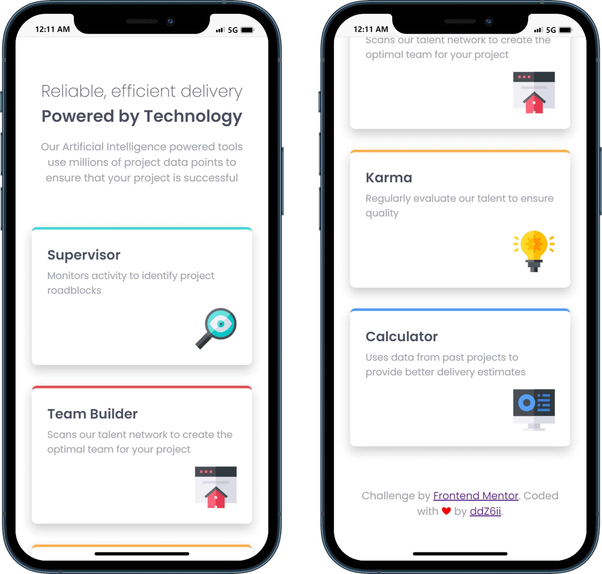
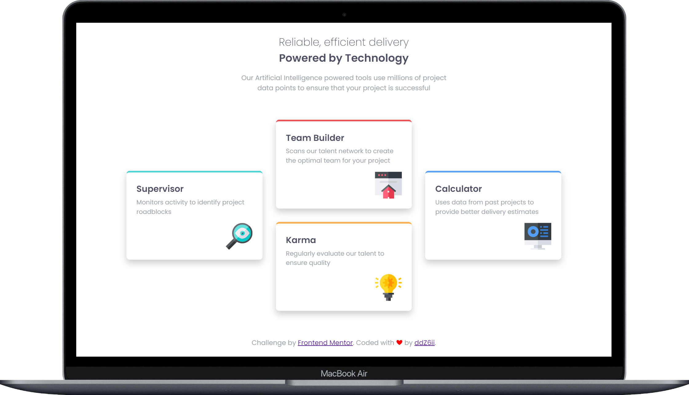

# Frontend Mentor - Four card feature section solution

This is a solution to the [Four card feature section challenge on Frontend Mentor](https://www.frontendmentor.io/challenges/four-card-feature-section-weK1eFYK). Frontend Mentor challenges help you improve your coding skills by building realistic projects.

## Table of contents

- [Overview](#overview)
  - [The challenge](#the-challenge)
  - [Screenshots](#screenshots)
  - [Links](#links)
- [Getting started](#getting-started)
- [My process](#my-process)
  - [Built with](#built-with)
  - [Deployed with](#deployed-with)
  - [What I learned](#what-i-learned)
- [Author](#author)

## Overview

### The challenge

Users should be able to:

- View the optimal layout for the site depending on their device's screen size

### Screenshots

- Mobile:
  

- Desktop:
  

### Links

- Solution URL: [frontend-mentor-solution](https://www.frontendmentor.io/solutions/mobile-first-and-responsive-landing-page-using-css-grid-uCRev0oE9r)
- Live Site URL: [four-card-feature-section-master](https://four-card-feature-section-master-puce.vercel.app/)

## Getting started

Clone the project and run the following command:

```console
yarn install
```

This will initialize the project by installing all the required dependencies.

## My process

### Built with


- Semantic HTML5 markup
- CSS custom properties
- Flexbox
- CSS Grid
- Parcel bundler
- Mobile-first workflow

### Deployed with


### What I learned

CSS `grid-template-areas` property is pretty neat 🚀

```css
.cards-layout {
  grid-template-areas:
    'supervisor team-builder calculator'
    'supervisor karma        calculator';
  grid-auto-columns: 1fr;
  align-items: center;
  gap: var(--spacing-base);
}

#supervisor {
  grid-area: supervisor;
}
#team-builder {
  grid-area: team-builder;
}
#karma {
  grid-area: karma;
}
#calculator {
  grid-area: calculator;
}
```

## Author

- Github - [@ddZ6ii](https://github.com/ddZ6ii)
- Frontend Mentor - [@ddZ6ii](https://www.frontendmentor.io/profile/ddZ6ii)
- Linkedin - [@denis-dezest](https://www.linkedin.com/in/denis-dezest/)
